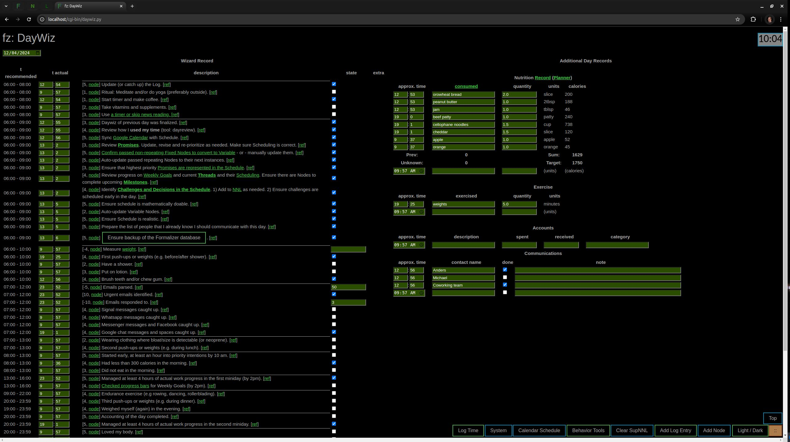

# Formalizer Manual

Fig.1 Example of the Day Wizard (DayWiz) page. The components on the page
are configured in the `wiztable.py` file. Records for any day can be
edited, and the records are tracked in the Formalizer database.
