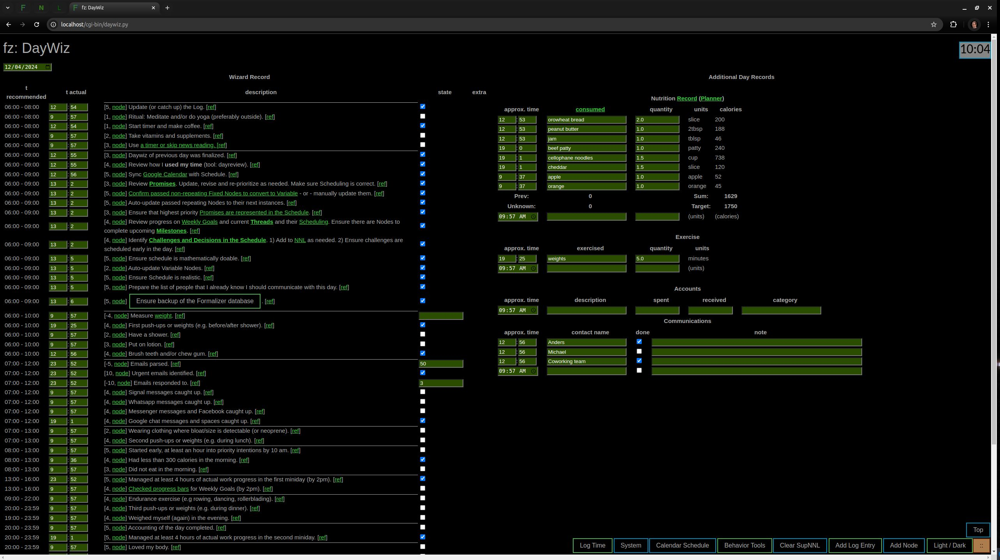

# Formalizer Manual

*Started 20261024. This manual summarizes and links to documentation that already
exists elsewhere (READMEs in the source tree, Sys:Doc pages, Doxygen, Google Docs),
rather than repeating it. Sections marked "(to be written)" still need content.*

**About links in this manual:** Links to READMEs and other files in the source tree go
to the [GitHub repository](https://github.com/randalkoene/formalizer), so they show the
last pushed version. Links to files in the `doc` directory are relative, and work both
locally (served by `fzserverpq` under `/fzdoc/`) and on GitHub. Links to sections of this
manual only jump on GitHub. Links to Formalizer web pages use `http://localhost/...` (if
Chrome is slow on `localhost`, use `127.0.0.1` instead, see
[installation notes](../installation.md)).



Fig.1 Example of the Day Wizard (DayWiz) page. The components on the page
are configured in the `wiztable.py` file. Records for any day can be
edited, and the records are tracked in the Formalizer database.

## Contents

- [Part I - Concepts](#part-i---concepts)
- [Part II - Daily use](#part-ii---daily-use)
- [Part III - Administration and maintenance](#part-iii---administration-and-maintenance)
- [Part IV - Architecture and development](#part-iv---architecture-and-development)
- [Appendices](#appendices)

---

## Part I - Concepts

### I.1 The System and the Formalizer

The *System* is the personal process of discovering Values, deriving Ideal and Improved
Situations from them, mapping a Roadmap with Milestones, planning, scheduling, logging,
and measuring, with ongoing review and improvement of each of those processes. The
*Formalizer* is the software framework (data structures, tools, protocols) that supports
it. See the top-level [README](https://github.com/randalkoene/formalizer/blob/master/README.md) for the summary list.

History:

- Formalizer 1.x was built around `dil2al` (still browsable through the "Formalizer v1.x
  (dil2al)" button under Information on the top page).
- Formalizer 2.x is the current environment: a PostgreSQL database, the `fzserverpq` data
  server, and many separate tools. The transition is described in the Google Doc
  [The System and the Formalizer](https://docs.google.com/document/d/1rYPFgzFgjkF1xGx3uABiXiaDR5sfmOzqYQRqSntcyyY/edit?usp=sharing).

Further background: [Sys:Doc](http://localhost/formalizer/doc.html) (System, Formalizer
and Personal documentation), including
[System Documentation](http://localhost/formalizer/system-documentation.html) and the
[Notes on Change](https://docs.google.com/document/d/1lBYknyQHhlhlqYZ3gku7OFTuM5FpFXV62jE2ETOnjv4/edit?usp=drive_link).

### I.2 Nodes

A Node is a task, goal or other item in the Graph. Its main properties (defined in
`core/include/Graphtypes.hpp`):

- **ID:** a time stamp of its creation plus a minor number, e.g. `20201002064246.1`.
- **Description:** HTML text.
- **Valuation:** typically between 1.0 and 3.0.
- **Completion:** 0.0 to 1.0 (1.0 = done). Negative values mark a Node as closed in
  other ways: -1 obsolete, -2 replaced, -3 done differently, -4 no longer possible.
  Nodes are not deleted once they have Log history (see
  [fzgraph README](https://github.com/randalkoene/formalizer/blob/master/core/fzgraph/README.md)).
- **Required time:** how long the Node is expected to take.
- **Target date (TD)** and **target date property**, which determines how the Schedule
  treats it:
  - `exact`: must happen at exactly that time (like an appointment).
  - `fixed` (FTD): must be done by that date; only changed by hand.
  - `variable` (VTD): should be done by that date, but may be moved.
  - `inherit` (ITD): takes its effective target date from a superior.
  - `unspecified` (UTD): placed in remaining time, in order, like a todo stack.
- **Repeats:** a repeating Node has a pattern (daily, workdays, weekly, biweekly,
  monthly, end-of-month offset, yearly), an `every` multiplier, and a `span` (number of
  repetitions, 0 = unlimited). `variable` and `unspecified` Nodes do not repeat.
- **Topics:** one or more topic tags with relevance values.
- **Boolean tags:** tags in the description that set flags, such as `@WORK@`,
  `@SELFWORK@`, `@SYSTEM@`, `@OTHER@` and `@TZADJUST@`. These are used for categorizing
  Nodes, e.g. in day reviews and the WORK/SELFWORK UTD Nodes pages.

### I.3 Edges, superiors and dependencies, Milestones

An Edge connects a dependency Node to a superior Node (the dependency contributes to, or
is needed for, the superior). Edges carry dependency, significance, importance, urgency
and priority values. Together the Nodes and Edges form the Graph.

Milestones are Nodes in the Roadmap that other work leads up to. Milestone Nodes are
marked by a bracketed upper-case name at the start of their description, e.g.
`[CARBONCOPIES]`, and the "Graph:" and "Current Work Tracks:" buttons on the top page
show them as boards (see `nodeboard` in [Part II](#ii7-boards-graph-views-and-planning)).

### I.4 Topics

Topics are tags with which Nodes are grouped by subject. All Topics are listed by the
[Topics](http://localhost/cgi-bin/fzgraphhtml-cgi.py?topics=?) button on the top page.
(to be written: how Topics are created and used)

### I.5 Named Node Lists (NNLs)

An NNL is a named, ordered list of Nodes, stored in the database (when NNLs are set to
persistent, which is the default). NNLs are used for selections, filters, tracking and
scheduling. Examples:

- `threads`, `week_main_goals`: current work tracks (Current Work Tracks on the top page).
- `promises`, `challenges_open`: reviewed in the System procedures
  ([System Documentation](http://localhost/formalizer/system-documentation.html)).
- `repeating_updated`, `batch_updated`, `passed_fixed`: filled by Schedule updating.
- Special commands such as `_select` (used when selecting a Node for the next Log chunk)
  act through NNL URLs on the server.

All NNLs: [Named Node Lists](http://localhost/cgi-bin/fzgraphhtml-cgi.py?srclist=?).

### I.6 The Log

The Log records what was actually done, in time order:

- A **Log chunk** is a period of work on one Node. Its ID is its start time stamp. It is
  open until closed.
- **Log entries** are notes within a chunk. Their IDs extend the chunk time stamp. An
  entry normally belongs to the chunk's Node, but can name a different Node.
- The Log of a Node (its *history*) is the chain of chunks and entries that belong to it.

See [Part II.3](#ii3-logging) for how the Log is used day to day.

### I.7 The Schedule

The Schedule is the planned order of incomplete Nodes, based on their target dates,
target date properties, required time and repeats. `fzupdate` updates it: it advances
repeating Nodes and re-places movable (variable and unspecified) Nodes into available
time. See:

- [Schedule Updating](https://github.com/randalkoene/formalizer/blob/master/core/doc/schedule-updating.md): how updating works.
- [fzupdate README](https://github.com/randalkoene/formalizer/blob/master/core/fzupdate/README.md): options and configuration.
- [Notes about scheduling](https://github.com/randalkoene/formalizer/blob/master/tools/system/schedule/README.md): how `inherit` and
  `unspecified` Nodes are handled.

### I.8 Metrics and indicators

Metrics are derived from the Log and Graph (time spent per category, sleep, work
balance), and from data entered in DayWiz. See the Metrics buttons on the top page,
[sysmet-extract](https://github.com/randalkoene/formalizer/blob/master/tools/system/metrics/sysmet-extract/README.md) (category
specifications such as Intentions and Work Performance),
[sysmet-add](https://github.com/randalkoene/formalizer/blob/master/tools/system/metrics/sysmet-add/README.md),
[dayreview](https://github.com/randalkoene/formalizer/blob/master/tools/system/metrics/dayreview/README.md) and
[fzmetricspq](https://github.com/randalkoene/formalizer/blob/master/core/fzmetricspq/README.md). Indicators are refreshed hourly (see
[Part III.3](#iii3-automation-daily-and-hourly-scripts)).

---

## Part II - Daily use

### II.1 The top dashboard

The top page is [`index.html`](http://localhost/index.html). Its sections:

- **System:** System page and Help, Next Nodes (the Schedule as a list), Recent Log,
  Schedule (week calendar), Named Node Lists, Topics, VTD/UTD Node pages, DayWiz, and more.
- **Metrics:** performance views and plots (see [I.8](#i8-metrics-and-indicators)).
- **Graph:** dependency trees and boards of Milestones.
- **Current Work Tracks / Other Current Tracks / Track Collections:** boards for the
  main Milestones and projects.
- **Communication**, **Information**, **Research Tools:** links to mail, Inbox Triage,
  documentation (including this Manual and Sys:Doc), and Claude Access.
- **Action:** Log Time, Add Log Entry, Log Chunk Granular, Filter Log, Search Graph,
  Select Node, Add Node, Filter & Edit Guide, Timer, FZ Admin.

The dashboard is generated from `tools/system/top/index.json` (see
[Part IV.4](#iv4-web-interface)).

### II.2 Working with Nodes

- **Finding Nodes:** Next Nodes, Search Graph
  ([form](http://localhost/formalizer/fzgraphsearch-form.html)), Select Node, Topics,
  NNLs, and the boards.
- **A Node's page:** `http://localhost/cgi-bin/fzlink.py?id=<node-id>`; add
  `&alt=histfull` for its full Log history.
- **Editing a Node:** the edit page from `fzgraphhtml-cgi.py?edit=<node-id>`
  ([fzgraphhtml README](https://github.com/randalkoene/formalizer/blob/master/tools/interface/fzgraphhtml/README.md)); the command line
  tool is [fzedit](https://github.com/randalkoene/formalizer/blob/master/core/fzedit/README.md).
- **Adding a Node:** the [Add Node](http://localhost/cgi-bin/fzgraphhtml-cgi.py?edit=new)
  button, which can start from a template; on the command line,
  [addnode](https://github.com/randalkoene/formalizer/blob/master/tools/interface/addnode/README.md) (which calls
  [fzgraph](https://github.com/randalkoene/formalizer/blob/master/core/fzgraph/README.md)).

### II.3 Logging

- **Recent Log:** the [Recent Log](http://localhost/cgi-bin/fzloghtml-cgi.py?frommostrecent=on&numchunks=100#END)
  page shows the latest chunks and is where entries are added and chunks closed.
- **Starting a new Log chunk:** [Log Time](http://localhost/cgi-bin/fzlogtime.cgi?source=nonlocal&cgivar=wrap)
  picks the start time ([fzlogtime](https://github.com/randalkoene/formalizer/blob/master/tools/interface/fzlogtime/README.md)), then
  "Select Node for next Log Chunk" picks the Node. This replaces the older command-line
  loop of [fztask](https://github.com/randalkoene/formalizer/blob/master/core/fztask/README.md). Chunks are opened and closed through
  [fzlog](https://github.com/randalkoene/formalizer/blob/master/core/fzlog/README.md).
- **Log entries:** [Add Log Entry](http://localhost/formalizer/logentry-form_fullpage.template.html),
  or [logentry](https://github.com/randalkoene/formalizer/blob/master/tools/interface/logentry/Readme.md) on the command line.
- **Catching up** on many chunks after time away:
  [fzcatchup](https://github.com/randalkoene/formalizer/blob/master/tools/interface/fzcatchup/README.md).
- **Finer control:** [Log Chunk Granular](http://localhost/granular-controls.html).
- **Viewing and filtering:** [Filter Log](http://localhost/formalizer/fzloghtml-form.html),
  [Log Index](http://localhost/cgi-bin/fzloghtml-cgi.py?index=on&alloflog=on)
  ([fzloghtml README](https://github.com/randalkoene/formalizer/blob/master/tools/interface/fzloghtml/README.md)). Links to local files
  in Log or Node text can start with `@FZSERVER@` (see
  [server address notes](../developer/server_address.md)).
- **Timer:** [Timer](http://localhost/formalizer/timer.html)
  ([README](https://github.com/randalkoene/formalizer/blob/master/tools/interface/timer/README.md)).

### II.4 The day cycle: DayWiz, checkboxes and the System guide

- **DayWiz:** the steps to carry out throughout the day, with day records stored in the
  database (Fig.1; [DayWiz](http://localhost/cgi-bin/daywiz.py?cmd=noredraw),
  [README](https://github.com/randalkoene/formalizer/blob/master/tools/system/daywiz/README.md)).
  DayWiz covers what EarlyWiz and LateWiz were made for, and those two are not in use at
  present.
- **Checkboxes:** a checkbox in a Log entry is a quick note about something to deal with
  later. Making one is faster than creating a Node or resolving the matter while in the
  middle of something else. As part of DayWiz, go through the open (unchecked) checkboxes
  on the [Checkboxes](http://localhost/cgi-bin/checkboxes.py?fromdate=20240401) page and
  work through them, either by turning them into Nodes (the page adds buttons for that)
  or by resolving them in other ways.
- **System guide:** AM and PM protocol guide content, served by
  [fzguide.system](https://github.com/randalkoene/formalizer/blob/master/core/fzguide.system/README.md) and edited through
  [Filter & Edit Guide](http://localhost/formalizer/fzguide.system-form.html).
- **System procedures** for regular review (Promises, Threads, Challenges, Schedule):
  [System Documentation](http://localhost/formalizer/system-documentation.html).

### II.5 Scheduling and updating

- **Viewing the Schedule:** [Next Nodes](http://localhost/cgi-bin/fzgraphhtml-cgi.py)
  and the [week calendar Schedule](http://localhost/cgi-bin/schedule-cgi.py?c=true&num_days=7&s=20).
- **Updating:** the `both`, `repeating` and `variable` options on the Next Nodes page call
  `fzupdate-cgi.py` ([Schedule Updating](https://github.com/randalkoene/formalizer/blob/master/core/doc/schedule-updating.md)).
- **Passed fixed target dates:** the System procedures include converting passed
  non-repeating FTD Nodes to VTD (`fzupdate-cgi.py?update=passedfixed` and
  `update=convert_passedfixed`).
- **Problems:** the Graph Condition section of the [FZ Admin](http://localhost/admin.html)
  page lists problematic target dates and other issues.

### II.6 Inbox Triage

Read-only sorting of unread mail into categories, with the reasons shown:
[Inbox Triage](http://localhost/cgi-bin/inbox-triage-cgi.py),
[README](https://github.com/randalkoene/formalizer/blob/master/tools/system/inbox-triage/README.md).

### II.7 Boards, graph views and planning

- [nodeboard](https://github.com/randalkoene/formalizer/blob/master/tools/interface/nodeboard/readme.md) generates Kanban-style boards of
  Node hierarchies and NNLs. Most buttons in the Graph and Tracks sections of the top page
  are nodeboard views.
- `fzvismilestones` draws Milestone graphs (Graph:Milestones, Graph:Cyto).
- (to be written: planning tools in `tools/system/planning`)

### II.8 Nutrition and other personal tracking

- [Day Nutrition](http://localhost/formalizer/day-nutrition.html) and the nutrition
  components of DayWiz ([DayWiz README](https://github.com/randalkoene/formalizer/blob/master/tools/system/daywiz/README.md)).
- (to be written)

### II.9 Working with Claude

Claude (Claude Code) reads Formalizer data only through `fzclaude`, which filters what
it can see and records what is disclosed. Changes are only proposed, and applied by hand.

- [HOWTO](https://github.com/randalkoene/formalizer/blob/master/tools/system/fzclaude/HOWTO.md): the day-to-day way of working on a Node
  with Claude.
- [README](https://github.com/randalkoene/formalizer/blob/master/tools/system/fzclaude/README.md): the tools, scope rules, guard hook and
  web interface ([Claude Access](http://localhost/cgi-bin/fzclaude-web-cgi.py)).
- [PLAN](https://github.com/randalkoene/formalizer/blob/master/tools/system/fzclaude/PLAN.md): where the project stands.

---

## Part III - Administration and maintenance

### III.1 The FZ Admin dashboard

[`admin.html`](http://localhost/admin.html), generated from `tools/system/top/admin.json`:

- **Node Server:** server status, request and error queues and logs, verbosity, database
  mode (run/log/sim), NNL persistence, refreshing Node histories, stopping the server.
- **Database:** list of database backups.
- **Environment:** Time Zone, Customize.
- **Graph Condition:** problematic target dates, Nodes without superiors,
  self-referential Nodes, integrity, Lost and Found, active repeated Nodes, oldest active
  Nodes, Nodes balance.
- **Log Condition:** full Log issues inspection
  ([fzlogdata](https://github.com/randalkoene/formalizer/blob/master/tools/interface/fzlogdata/README.md)).
- **Backups:** the regular full backup Node, duplicating/restoring the account, and
  set-up and replication of the System environment (see [III.4](#iii4-backups) and
  [III.5](#iii5-duplicating-restoring-and-replicating-the-environment)).

### III.2 Running the data server

`fzserverpq` holds the Graph in shared memory and serializes all database access. Most
tools need it to be running. Start it with `fzserverpqd.sh`. Its port and the roots from
which it serves files are set in `~/.formalizer/config/fzserverpq/config.json`; when it
starts, it writes its address to `~/.formalizer/server_address`.

- [fzserverpq README](https://github.com/randalkoene/formalizer/blob/master/core/fzserverpq/README.md), `fzserverpq -h`.
- [fzserver-info](https://github.com/randalkoene/formalizer/blob/master/tools/interface/fzserver-info/README.md): inspect server state.
- [Finding the server address](../developer/server_address.md).
- After the server address changes, regenerate the dashboards
  ([top README](https://github.com/randalkoene/formalizer/blob/master/tools/system/top/README.md)).

### III.3 Automation: daily and hourly scripts

[`tools/glue/fzcrontab`](https://github.com/randalkoene/formalizer/blob/master/tools/glue/fzcrontab) runs `fzdaily.sh` three times a day
(it does its work only once per day) and `fzhourly.sh` twice an hour. The work is listed
in `~/.formalizer/fzdaily_do.source` and `~/.formalizer/fzhourly_do.source`:

- daily: the database backup (`fzbackup`) and refreshing Node histories;
- hourly: email counts and indicators.

See the [glue README](https://github.com/randalkoene/formalizer/blob/master/tools/glue/README.md).

### III.4 Backups

- **Database backups:** `fzbackup` writes a compressed database dump to
  `~/.formalizer/archive/postgres/` (run daily, see III.3). `fzbackup-mirror-to-github.sh`
  pushes the backups and DayWiz data to GitHub. See the
  [fzbackup README](https://github.com/randalkoene/formalizer/blob/master/core/fzbackup/README.md) and the Backups button under Database
  on the Admin page.
- **Regular full environment backup:** `backup-environment -full`, option `b`, when Node
  20201002064246.1 comes up. It rsyncs `/home/randalk` (including `~/.formalizer` and
  `~/.claude`), `/var/www` and `/usr/lib/cgi-bin` to a partition file on the external
  drive. Option `c` creates a new partition file. Details:
  [backup-environment](https://github.com/randalkoene/formalizer/blob/master/core/fzbackup/README.md#backup-environmentpy---backup-the-whole-account).
- **Restoring a database backup:** `fzrestore.sh [-n] [-s <existing-schema>] <dbbackup-path>`
  (`fzrestore.sh -h` for details).

### III.5 Duplicating, restoring and replicating the environment

- [replicate](https://github.com/randalkoene/formalizer/blob/master/tools/system/replicate/README.md): reinstall a complete System
  environment from a `backup-environment` backup.
- [Set-up and Replicate System Environment](http://localhost/formalizer/setup-and-replicate.html).
- "Duplicate / Restore Account" on the Admin page (a PDF in `~/doc/txt/`).

### III.6 Time zones and travel

`fztimezone` adjusts for a change of time zone
([Time Zone](http://localhost/cgi-bin/fztimezone-cgi.py?show=true) on the Admin page).
Nodes tagged `@TZADJUST@` are adjusted. (to be written: the procedure when traveling)

### III.7 Data integrity

The Graph Condition and Log Condition sections of the Admin page, and the
[Integrity](http://localhost/integrity.html) page. (to be written)

### III.8 Configuration

Each component reads `~/.formalizer/config/<component>/config.json`, in a flat subset of
JSON. Initialize the directories with `fzsetup.py -C`. See the
[config README](https://github.com/randalkoene/formalizer/blob/master/config/README.md) and [fzsetup](https://github.com/randalkoene/formalizer/blob/master/core/fzsetup/README.md).
`fzinfo` reports on the installed environment ([README](https://github.com/randalkoene/formalizer/blob/master/core/fzinfo/README.md)).

---

## Part IV - Architecture and development

### IV.1 Layers

1. **Data layer:** C++ types for the Graph (`Graphtypes`) and Log (`Logtypes`) in
   `core/include` and `core/lib`, with Python wrappers.
2. **Database layer:** PostgreSQL access via `libpq` (`Graphpostgres.cpp`,
   `Logpostgres.cpp`).
3. **Data server layer:** `fzserverpq`.

Above these are the core programs and the tools. See the [core README](https://github.com/randalkoene/formalizer/blob/master/core/README.md)
for what belongs in `core`.

### IV.2 Communicating with `fzserverpq`

- C++ tools use the shared-memory API (e.g. Node editing in the
  [fzedit README](https://github.com/randalkoene/formalizer/blob/master/core/fzedit/README.md)) or TCP calls (`tcpclient.cpp`,
  `apiclient.cpp`).
- Python tools use `core/include/tcpclient.py` and `Graphaccess.py`.
- The server answers HTTP requests on its port, including `/fz/...` API paths and
  file serving; examples of routes are in the [fzgraph README](https://github.com/randalkoene/formalizer/blob/master/core/fzgraph/README.md).
- From the browser, calls can be forwarded through `fzgraph-cgi.py?action=generic` or
  [fzapicall](https://github.com/randalkoene/formalizer/blob/master/tools/interface/fzapicall/README.md)
  ([server address notes](../developer/server_address.md)).
- [CGI API self-documentation](http://localhost/cgi-bin/cgi_api_help.py).
- [Tracing actions](../developer/tracing_actions.md): example traces through the server.

### IV.3 Core programs

`fzgraph` (add Nodes, Edges, Topics), `fzedit` (edit them), `fzlog` (modify the Log),
`fzquerypq` (queries, Node history refresh), `fzupdate` (Schedule), `fztask` (task
control loop), `fzbackup`, `fzsetup`, `fzinfo`, `fzguide.system`, `fzmetricspq`,
`fztimezone`, `fzserverpq`. See [Appendix B](#b-programs-and-scripts).

### IV.4 Web interface

- CGI scripts are named `<program>-cgi.py` and are installed in `/usr/lib/cgi-bin/`.
  Shared Python modules in `core/include/` are symlinked there.
- Web files are installed in `/var/www/html/` and `/var/www/html/formalizer/`.
- Dashboards are generated from JSON by `fzdashboard -D index|admin|legacy`
  ([top README](https://github.com/randalkoene/formalizer/blob/master/tools/system/top/README.md)).
- Which directories each of the user and `www-data` may write:
  [installation notes](../installation.md).
- [Standards mode](../developer/standards_mode.md): notes on page DOCTYPE.

### IV.5 Building and deploying

```
cd core/lib && make      # core library
make build               # library and all compilable components
make executables         # symlinks, executables, CGI scripts, web files (sudo)
make doxygen             # refresh the Doxygen documentation
```

`fzbuild -C`, `-M`, `-r` are shortcuts ([fzbuild](https://github.com/randalkoene/formalizer/blob/master/tools/dev/fzbuild/README.md)).
`fzpackage` packages the environment without sources
([README](https://github.com/randalkoene/formalizer/blob/master/tools/dev/fzpackage/README.md)).

### IV.6 Writing a new tool

Use [boilerplate](https://github.com/randalkoene/formalizer/blob/master/tools/dev/boilerplate/README.md) to start a standard C++ or
Python program (main source, header, Makefile, version header). Small Python scripts,
especially little CGI scripts that need no special imports, gain little from it and are
often written without it. Add a new tool to the categories
in the top `Makefile` (EXECUTABLES, SYMBIN, CGIEXE, ...). See also
[tools/misc](https://github.com/randalkoene/formalizer/blob/master/tools/misc/README.md).

**C++ or Python:** the choice is about complexity and speed. Simple things deserve a
Python script. Things that churn through data are better done in C++.

**Reuse the core library.** Many handy functions already exist, so look there before
writing new code:

- C++ (`core/include/*.hpp`, `core/lib/`): `Graphtypes` (Nodes, Edges, Topics, NNLs),
  `Graphinfo` (selecting and sorting Nodes, e.g. incomplete Nodes by target date),
  `Graphmodify` (requesting changes through the server), `Graphaccess` (standard Graph
  access), `Logtypes`, `Loginfo`, `Logaccess`, `TimeStamp`, `templater` (simple
  templating for generated output), `jsonlite`, `stringio`, `general`, `config`, `error` and `standard` (the
  standard program structure).
- Python (`core/include/*.py`): `Graphaccess`, `Logaccess`, `tcpclient` (server calls),
  `fzhtmlpage` (page building), `fzcmdcalls`, `fzmodbase`, `TimeStamp`.

### IV.7 Installation on a new machine

See the top-level [README](https://github.com/randalkoene/formalizer/blob/master/README.md), [fzsetup](https://github.com/randalkoene/formalizer/blob/master/core/fzsetup/README.md),
[installation notes](../installation.md), and [replicate](https://github.com/randalkoene/formalizer/blob/master/tools/system/replicate/README.md).

---

## Appendices

### A. Glossary

- **BTF:** Boolean Tag Flags, set by tags such as `@WORK@` in a Node's description.
- **Chunk:** a Log chunk, a period of work on one Node.
- **EPS map:** the map of time slots that `fzupdate` uses to place Nodes.
- **ETD / FTD / VTD / ITD / UTD:** exact, fixed, variable, inherited and unspecified
  target date properties.
- **Milestone:** a Roadmap Node that other work leads to.
- **NNL:** Named Node List.
- **Superior / dependency:** the two ends of an Edge.
- **TD:** target date.
- **Thread:** a current work track, in the `threads` NNL.
- (to be extended)

### B. Programs and scripts

| Program | Purpose | Docs |
|---|---|---|
| `fzserverpq` | Graph data server | [README](https://github.com/randalkoene/formalizer/blob/master/core/fzserverpq/README.md) |
| `fzserverpq-log` | Log data server | [README](https://github.com/randalkoene/formalizer/blob/master/core/fzserverpq-log/README.md) |
| `fzgraph` | Add Nodes, Edges, Topics | [README](https://github.com/randalkoene/formalizer/blob/master/core/fzgraph/README.md) |
| `fzedit` | Edit Nodes, Edges, Topics | [README](https://github.com/randalkoene/formalizer/blob/master/core/fzedit/README.md) |
| `fzlog` | Modify the Log | [README](https://github.com/randalkoene/formalizer/blob/master/core/fzlog/README.md) |
| `fzquerypq` | Query the database | [README](https://github.com/randalkoene/formalizer/blob/master/core/fzquerypq/README.md) |
| `fzupdate` | Update the Schedule | [README](https://github.com/randalkoene/formalizer/blob/master/core/fzupdate/README.md) |
| `fztask` | Task control loop | [README](https://github.com/randalkoene/formalizer/blob/master/core/fztask/README.md) |
| `fzbackup` | Database backup | [README](https://github.com/randalkoene/formalizer/blob/master/core/fzbackup/README.md) |
| `backup-environment` | Full environment backup | [README](https://github.com/randalkoene/formalizer/blob/master/core/fzbackup/README.md#backup-environmentpy---backup-the-whole-account) |
| `fzsetup` | Set up an environment | [README](https://github.com/randalkoene/formalizer/blob/master/core/fzsetup/README.md) |
| `fzinfo` | Environment information | [README](https://github.com/randalkoene/formalizer/blob/master/core/fzinfo/README.md) |
| `fzguide.system` | System guide content | [README](https://github.com/randalkoene/formalizer/blob/master/core/fzguide.system/README.md) |
| `fzmetricspq` | Metrics tables | [README](https://github.com/randalkoene/formalizer/blob/master/core/fzmetricspq/README.md) |
| `fztimezone` | Time zone changes | |
| `fzgraphhtml` | Graph data as HTML | [README](https://github.com/randalkoene/formalizer/blob/master/tools/interface/fzgraphhtml/README.md) |
| `fzloghtml` | Log data as HTML | [README](https://github.com/randalkoene/formalizer/blob/master/tools/interface/fzloghtml/README.md) |
| `fzlogtime` | Time picker for new chunks | [README](https://github.com/randalkoene/formalizer/blob/master/tools/interface/fzlogtime/README.md) |
| `fzlogdata` | Log inspection | [README](https://github.com/randalkoene/formalizer/blob/master/tools/interface/fzlogdata/README.md) |
| `fzlogmap` | Log mapping for metrics | [README](https://github.com/randalkoene/formalizer/blob/master/tools/interface/fzlogmap/README.md) |
| `fzserver-info` | Server state | [README](https://github.com/randalkoene/formalizer/blob/master/tools/interface/fzserver-info/README.md) |
| `fzdashboard` | Generate dashboards | [README](https://github.com/randalkoene/formalizer/blob/master/tools/interface/fzdashboard/README.md) |
| `nodeboard` | Kanban boards | [README](https://github.com/randalkoene/formalizer/blob/master/tools/interface/nodeboard/readme.md) |
| `addnode` | Add Nodes (command line) | [README](https://github.com/randalkoene/formalizer/blob/master/tools/interface/addnode/README.md) |
| `logentry` | Log entries (command line) | [README](https://github.com/randalkoene/formalizer/blob/master/tools/interface/logentry/Readme.md) |
| `fzcatchup` | Log catch-up | [README](https://github.com/randalkoene/formalizer/blob/master/tools/interface/fzcatchup/README.md) |
| `fzapicall.py` | Forward API calls | [README](https://github.com/randalkoene/formalizer/blob/master/tools/interface/fzapicall/README.md) |
| `timer` | Timer page | [README](https://github.com/randalkoene/formalizer/blob/master/tools/interface/timer/README.md) |
| `daywiz` | Day cycle wizard | [II.4](#ii4-the-day-cycle-daywiz-checkboxes-and-the-system-guide) |
| `checkboxes.py` | Open checkboxes in the Log | [II.4](#ii4-the-day-cycle-daywiz-checkboxes-and-the-system-guide) |
| `schedule` | Calendar Schedule views | [README](https://github.com/randalkoene/formalizer/blob/master/tools/system/schedule/README.md) |
| `sysmet-extract`, `sysmet-add`, `dayreview` | Metrics | [I.8](#i8-metrics-and-indicators) |
| `inbox-triage` | Mail triage | [README](https://github.com/randalkoene/formalizer/blob/master/tools/system/inbox-triage/README.md) |
| `fzclaude` | Claude's access | [README](https://github.com/randalkoene/formalizer/blob/master/tools/system/fzclaude/README.md) |
| `replicate` | Environment replication | [README](https://github.com/randalkoene/formalizer/blob/master/tools/system/replicate/README.md) |
| `requestmanual.py` | Ask the user to do a step | [README](https://github.com/randalkoene/formalizer/blob/master/tools/system/requestmanual/README.md) |
| `fzbuild`, `boilerplate`, `fzpackage` | Development | [IV.5](#iv5-building-and-deploying), [IV.6](#iv6-writing-a-new-tool) |

### C. Other documentation

- [Sys:Doc](http://localhost/formalizer/doc.html): entry point to System, Formalizer and
  Personal documentation.
- [System Help](http://localhost/formalizer/system-help.html),
  [Ready Docs](http://localhost/formalizer/ready-docs.html),
  [Tips](http://localhost/formalizer/tips.html).
- [Doxygen](http://localhost/formalizer/doxygen-html/index.html): source code
  documentation (refreshed with `make doxygen`).
- Google Docs: [The System and the Formalizer](https://docs.google.com/document/d/1rYPFgzFgjkF1xGx3uABiXiaDR5sfmOzqYQRqSntcyyY/edit?usp=sharing),
  [Old Formalizer Documentation](https://docs.google.com/document/d/1XKxzroEhRRfWxvThcvUcCVDVG-EPcIY_QNJFeP8fd5s/edit?usp=sharing),
  [Formalizer Tutorial](https://docs.google.com/presentation/d/14W3Si2YHAnpXmZ8sBfLdOERz1DlFU5HEkFWW_Rc7Zl4/edit?usp=sharing).
- Developer notes: [server address](../developer/server_address.md),
  [tracing actions](../developer/tracing_actions.md),
  [standards mode](../developer/standards_mode.md).
- [CHANGES](https://github.com/randalkoene/formalizer/blob/master/CHANGES.md) (older change notes).
